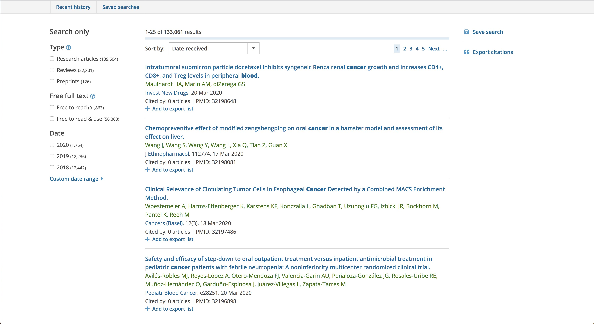

# js-solr-highlighter
A JavaScript library for highlighting HTML text based on the query in the lucene/solr query syntax
Built based on [lucene](https://github.com/bripkens/lucene "lucene") and [text-annotator](https://github.com/zhan-huang/text-annotator "text-annotator")
The general highlighting process is:
1. Derive which text to highlight from a query in the lucene syntax
2. Highlight the derived text in the HTML

## An example from [Europe PMC](https://europepmc.org "Europe PMC")
https://europepmc.org/search?query=blood%20AND%20TITLE%3Acancer


## Basic usage
### No options
```javascript
var query = 'cancer AND blood'
var content = 'Platelet Volume Is Reduced In Metastasing Breast Cancer: Blood Profiles Reveal Significant Shifts.'
var highlightedContent = highlightByQuery(query, content)
// 'Platelet Volume Is Reduced In Metastasing Breast <span id="highlight-0" class="extra-bold">Cancer</span>: <span id="highlight-1" class="extra-bold">Blood</span> Profiles Reveal Significant Shifts.'
```
### With the validFields options that specify the fields valid in the query syntax. If not specified, all like X:X will be valid fields
```javascript
var query = 'TITLE:blood AND CONTENT:cell'
var content = 'A molecular map of lymph node blood vascular endothelium at single cell resolution'
var options = { validFields: ['TITLE'] }
var highlightedContent = highlightByQuery(query, content, options)
// 'A molecular map of lymph node <span id="highlight-0" class="extra-bold">blood</span> vascular endothelium at single cell resolution'
// "cell" will not be highlighted
```
### With the highlightedFields options that specify the valid fields whose values will be highlighted. If not specified, the values of all valid fields will be highlighted
```javascript
var query = 'TITLE:blood OR CONTENT:cell'
var content = 'A molecular map of lymph node blood vascular endothelium at single cell resolution'
var options = { validFields: ['TITLE', 'CONTENT'], highlightedFields: ['CONTENT'] }
var highlightedContent = highlightByQuery(query, content, options)
// 'A molecular map of lymph node blood vascular endothelium at single <span id="highlight-0" class="extra-bold">cell</span> resolution'
// "blood" will not be highlighted
```

## Options

## Highlighting rules

## Contact
[Zhan Huang](z2hm@outlook.com "Zhan Huang")
